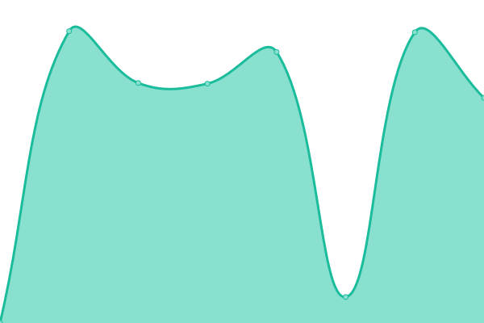
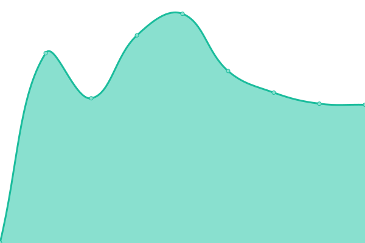
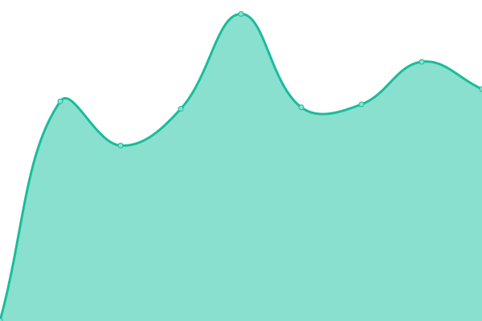

# [📈 Live Status](https://status.planetary-quantum.com): <!--live status--> **🟩 All systems operational**

This repository contains the open-source uptime monitor and status page for [Planetary Quantum GmbH](https://www.planetary-quantum.com/), powered by [Upptime](https://github.com/upptime/upptime).

With [Upptime](https://upptime.js.org), you can get your own unlimited and free uptime monitor and status page, powered entirely by a GitHub repository. We use [Issues](https://github.com/hostwithquantum/status.planetary-quantum.com/issues) as incident reports, [Actions](https://github.com/hostwithquantum/status.planetary-quantum.com/actions) as uptime monitors, and [Pages](https://status.planetary-quantum.com) for the status page.

<!--start: status pages-->
<!-- This summary is generated by Upptime (https://github.com/upptime/upptime) -->
<!-- Do not edit this manually, your changes will be overwritten -->
<!-- prettier-ignore -->
| URL | Status | History | Response Time | Uptime |
| --- | ------ | ------- | ------------- | ------ |
|  [Console](https://console.planetary-quantum.com/) | 🟩 Up | [console.yml](https://github.com/hostwithquantum/status.planetary-quantum.com/commits/HEAD/history/console.yml) | 

 1548ms
     
 | 

<a href="https://status.planetary-quantum.com/history/console">100.00%</a>
    

|  [Managed Logging](https://logs.planetary-quantum.com/loki/ready) | 🟩 Up | [managed-logging.yml](https://github.com/hostwithquantum/status.planetary-quantum.com/commits/HEAD/history/managed-logging.yml) | 

 825ms
     
 | 

<a href="https://status.planetary-quantum.com/history/managed-logging">100.00%</a>
    

|  [Managed Metrics](https://metrics.planetary-quantum.com/) | 🟩 Up | [managed-metrics.yml](https://github.com/hostwithquantum/status.planetary-quantum.com/commits/HEAD/history/managed-metrics.yml) | 

 672ms
     
 | 

<a href="https://status.planetary-quantum.com/history/managed-metrics">100.00%</a>
    

|  [Managed Registry](https://r.planetary-quantum.com/) | 🟩 Up | [managed-registry.yml](https://github.com/hostwithquantum/status.planetary-quantum.com/commits/HEAD/history/managed-registry.yml) | 

 822ms
     
 | 

<a href="https://status.planetary-quantum.com/history/managed-registry">100.00%</a>
    

|  [quantum-cli](https://cli.planetary-quantum.com/) | 🟩 Up | [quantum-cli.yml](https://github.com/hostwithquantum/status.planetary-quantum.com/commits/HEAD/history/quantum-cli.yml) | 

 245ms
     
 | 

<a href="https://status.planetary-quantum.com/history/quantum-cli">100.00%</a>
    

|  [Quantum ID](https://id.planetary-quantum.com/) | 🟩 Up | [quantum-id.yml](https://github.com/hostwithquantum/status.planetary-quantum.com/commits/HEAD/history/quantum-id.yml) | 

 810ms
     
 | 

<a href="https://status.planetary-quantum.com/history/quantum-id">100.00%</a>
    

|  [Documentation](https://docs.planetary-quantum.com/) | 🟩 Up | [documentation.yml](https://github.com/hostwithquantum/status.planetary-quantum.com/commits/HEAD/history/documentation.yml) | 

 862ms
     
 | 

<a href="https://status.planetary-quantum.com/history/documentation">100.00%</a>
    

|  [Website](https://www.planetary-quantum.com/) | 🟩 Up | [website.yml](https://github.com/hostwithquantum/status.planetary-quantum.com/commits/HEAD/history/website.yml) | 

 767ms
     
 | 

<a href="https://status.planetary-quantum.com/history/website">100.00%</a>
    

|  [Object Storage](https://s3.storage.planetary-networks.de/) | 🟩 Up | [object-storage.yml](https://github.com/hostwithquantum/status.planetary-quantum.com/commits/HEAD/history/object-storage.yml) | 

 978ms
     
 | 

<a href="https://status.planetary-quantum.com/history/object-storage">100.00%</a>
    

<!--end: status pages-->

[**Visit our status website →**](https://status.planetary-quantum.com)

## 📄 License

- Powered by: [Upptime](https://github.com/upptime/upptime)
- Code: [MIT](./LICENSE) © [Planetary Quantum GmbH](https://www.planetary-quantum.com/)
- Data in the `./history` directory: [Open Database License](https://opendatacommons.org/licenses/odbl/1-0/)
